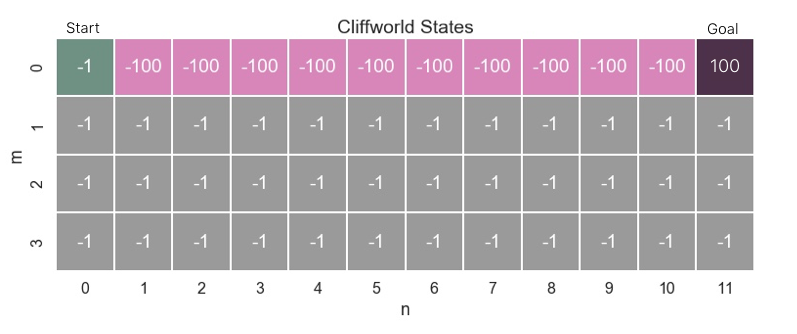

# Training An Reinforcement Learning Agent
Training a basic Reinforcement Learning Agent using Q-Learning. After random exploration it learns to reach goal in shortest way, avoiding the cliff states.

  
